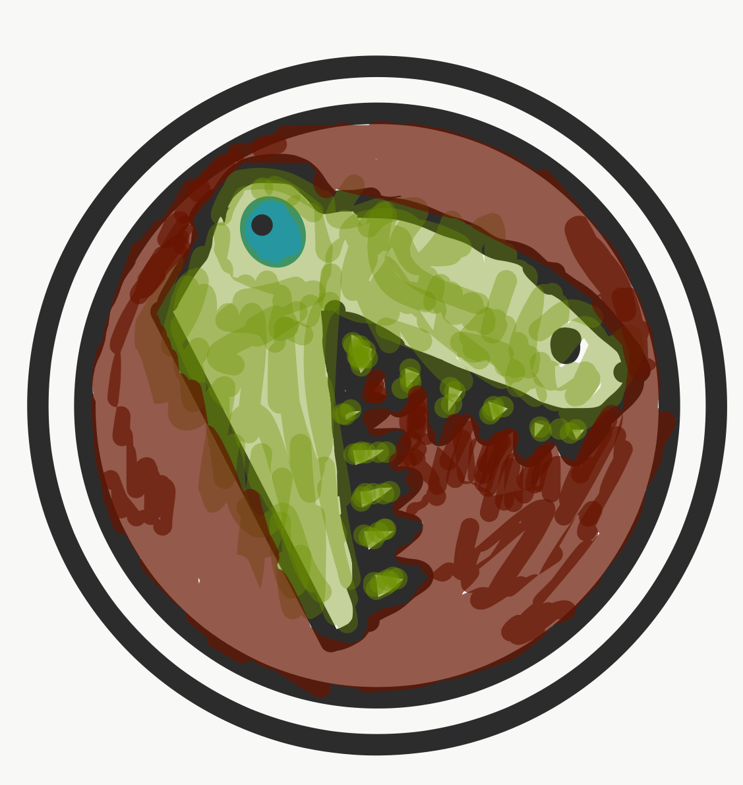

# Troodon
Exceptional in-browser searching, even in low light

_The remarkable thing about the Troodon, is the large forward facing
eyes that would have allowed for exceptional stereoscopic vision even
in low light conditions._

Troodon is a brower plugin that enhances the search capabilities to
improve the browser experience for web power users.

Written in Rust and compiled to web assembly for performance, Troodon
enables users to use the following approaches to search which are
typically not available in common or garden browser find functions:

* Fuzzy Matching
* Glob Matching
* Regex Matching

The search operations can be performed in the current page, across all
open tabs in the current window, or across all open windows.
